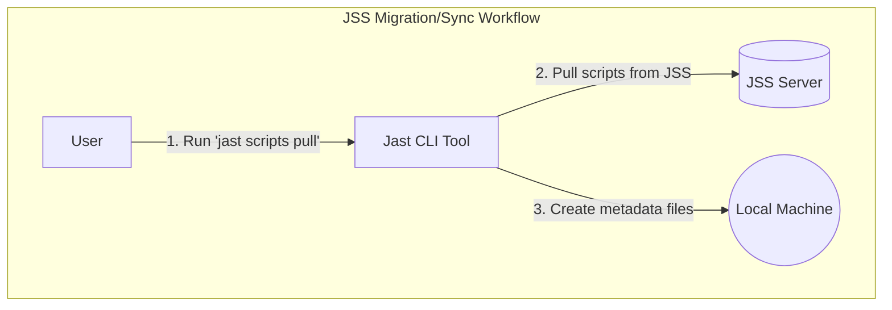
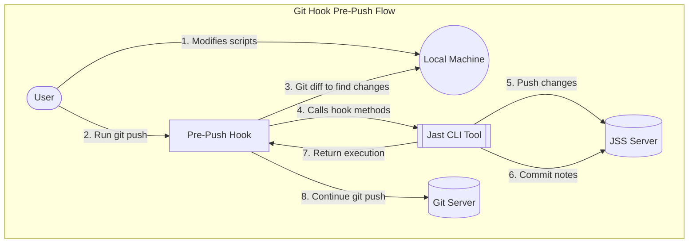
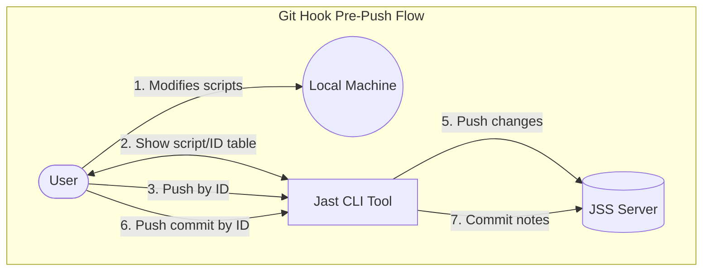
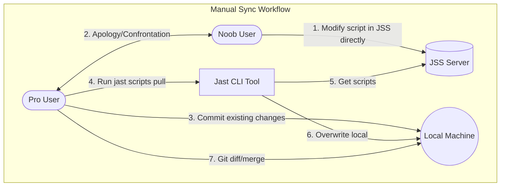

# Jamf Script Tool (JaST)

[](https://pypi.org/project/jamf-script-tool)
[](https://pypi.org/project/jamf-script-tool)

-----

Jast is a tool for managing Jamf scripts locally.
It allows you to download, create and update scripts through the Jamf API.
This opens the door for a few things:
- **local development**: BYO IDE, linters, extensions, formatters, etc.
- **version control**: git, GitHub, etc.
- **workflow automation**: CI/CD pipelines.

## Table of Contents

- [Installation](#installation)
- [License](#license)
- [Configuration](#configuration)
- [Usage](#usage)


## Installation
Simply install with [pipx](https://pypi.org/project/pipx/). 

Pipx isolates the tool from the rest of your system, and allows you to install it globally.

```console
pipx install jamf-script-tool
```

If you're planning on using the git hook functionality, you'll need to install the pre-commit framework.

```console
pipx install pre-commit
```

## License

`jamf-script-tool` is distributed under the terms of the [MIT](https://spdx.org/licenses/MIT.html) license.

## Configuration
Configuration is provided through a toml file located in the user's application data directory. Default values are either sensible defaults or placeholders. To edit configuration, run:

```console
jast config edit
```

> [!IMPORTANT]
>
> If developing locally, Jast will prioritise environment variables.
> To prevent usage of existing Jamf environment variables and undesirable modification of a different Jamf instance, the `JAST__` prefix is used, e.g:
> ```console
> JAST__JAMF_URL
> ```


## Usage

**Jast** uses Typer for a convenient CLI.

To see all available commands, run:

```console
> jast --help

 Usage: jast [OPTIONS] COMMAND [ARGS]...                                                   
                                                                                             
╭─ Options ─────────────────────────────────────────────────────────────────────────────────╮
│ --install-completion          Install completion for the current shell.                   │
│ --install-hooks               Install git hooks with pre-commit framework.                │
│ --show-completion             Show completion for the current shell, to copy it or        │
│                               customize the installation.                                 │
│ --help                        Show this message and exit.                                 │
╰───────────────────────────────────────────────────────────────────────────────────────────╯
╭─ Commands ────────────────────────────────────────────────────────────────────────────────╮
│ config   Manage JAST configuration settings.                                              │
│ scripts  Manage JSS scripts.                                                              │
╰───────────────────────────────────────────────────────────────────────────────────────────╯

```
> [!TIP]
> You can also run `--help` on individual commands.

### Workflows


#### Initial Setup


1. **Initialise** - Start a new git repo for your scripts. See [git docs](https://git-scm.com/book/en/v2/Git-Basics-Getting-a-Git-Repository) for best practices.

2. **Configure** - Run `jast config edit`. This creates a toml configuration file in the current user's application data directory and opens it for editing. Run `jast config browse` to find it.

3. **Install hooks** - Run `jast --install-hooks`. This installs a `pre-push` hook that runs using the Python pre-commit framework. If you're already using pre-commit, this will simply append the hook to your existing `.pre-commit-config.yaml` file.

3. **Migrate** - Run `jast scripts pull`. This pulls everything from the JSS server down to the local machine, creating necessary toml metadata files.

#### Development (Git Hook)



1. **Develop** - Modify scripts to your hearts content, using your favourite IDE, extensions, linters, workflows and AI tools, etc. Stage and commit with git as you usually would. 

2. **Push** When running git push, the pre-push hook runs: 

    1. It runs a git diff that compares the current local state to the current remote state, fetching all commits in the process. From this it derives the files that have been added, modified and deleted. 
    2. It pushes added and modified files to the JSS server, and deletes (or soft deletes, if configured) any files deleted locally. 
    3. Then it pushes the commit message as a new history note for each added or modified script.

3. The git push itself runs, pushing all the same changes to git. Git remains the single source of truth. If someone else clones the repo, all the changes will be kept up to date.

#### Development (Manual Push)


1. **Develop** - Modify scripts to your hearts content, using your favourite IDE, extensions, linters, workflows and AI tools, etc. Stage and commit with git as you usually would.

2. **Lookup** - Run `jast scripts show` to get a table of all existing scripts registered in the JSS server and their corresponding IDs.

2. **Push** - Run `jast scripts push --id ___` to push a modified script by its ID to the JSS server.

3. **History** - Run `jast history new --id ___ --note ___` to push a new history note to the script corresponding to the ID. (To be honest, your probably don't want to do this... It's a lot of effort. *Use the hooks instead.*)

#### Manual Sync



There is usually no need to pull from the JSS server with jast after the first pull. This is essentially a one-time sync. Jast itself handles keeping JSS up to date with git after this. 

Running "jast scripts pull" would only be necessary if changes are made to the scripts directly within JSS. The user would be prompted to choose to overwrite if there are any file collisions, but there is no fancy local/remote merge conflict resolution like with git.

If you must run a pull because changes have occurred on the JSS server that are untracked in git, just commit and push any local changes to git first, then run `jast scripts pull --force`. You may then go through all of the modified files and selectively audit changes and commit them properly.

